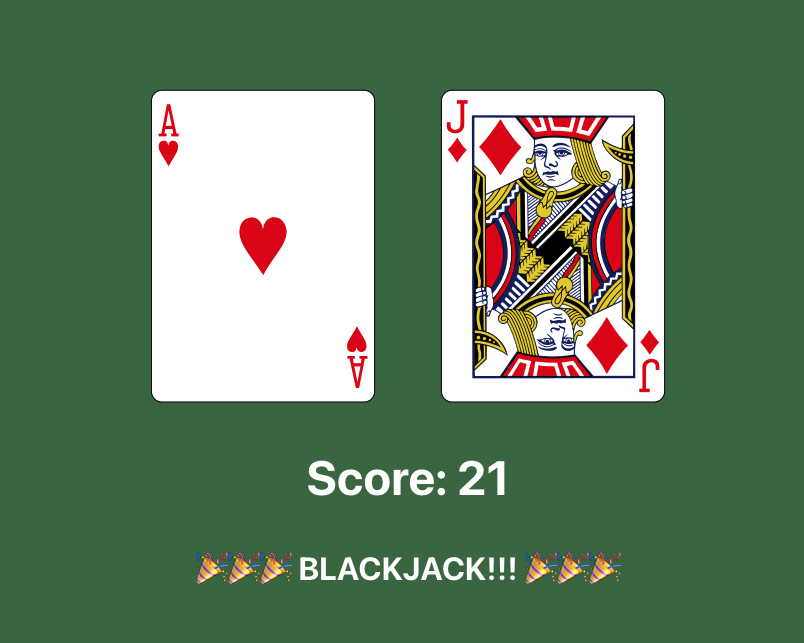

# Blackjack App

This project was bootstrapped with [Create React App](https://github.com/facebook/create-react-app).

This app automatically deals you two cards from a 52-card deck. Each card has a score assigned to it: aces will be worth 11; tens, jacks, queens, and kings will be worth 10; every other card will be worth its value (twos will be worth 2, threes will be worth 3, etc.).  

If the score is 21, you have blackjack!  .

If you want different cards, you’ll have to refresh the page.

 
